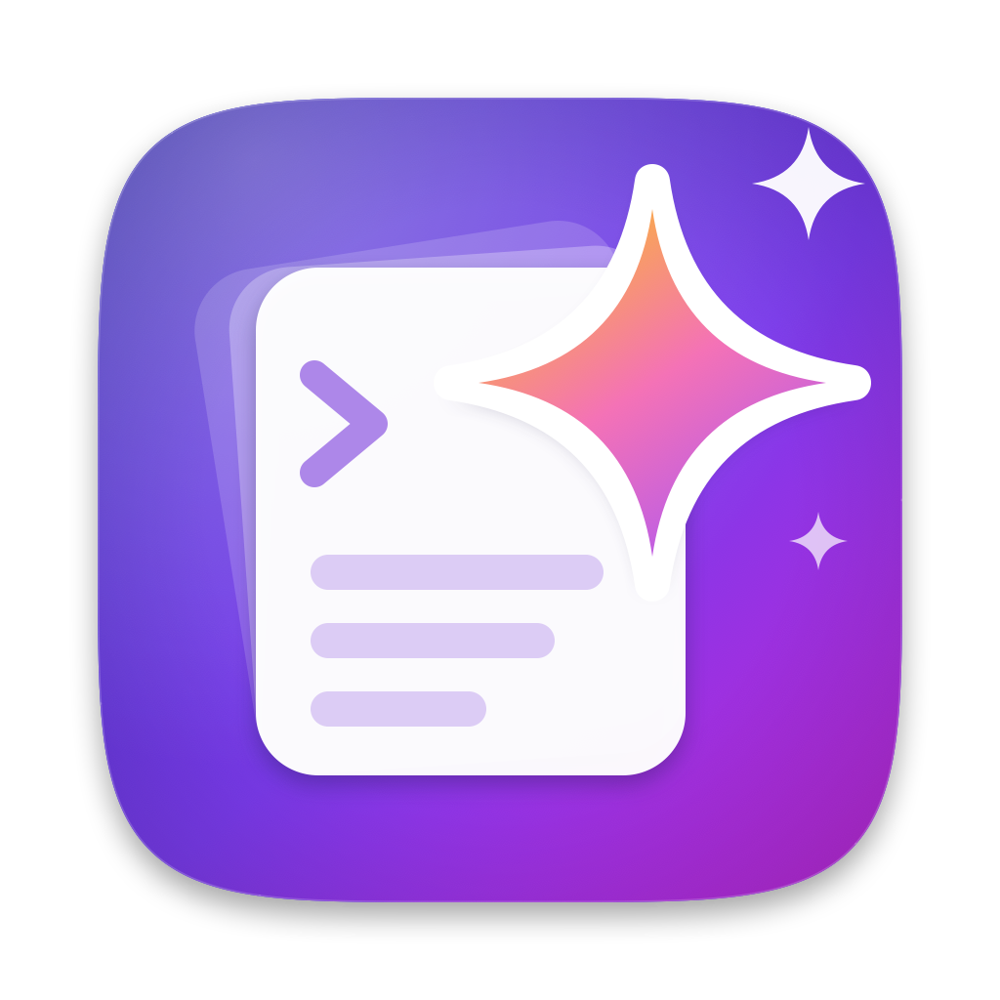
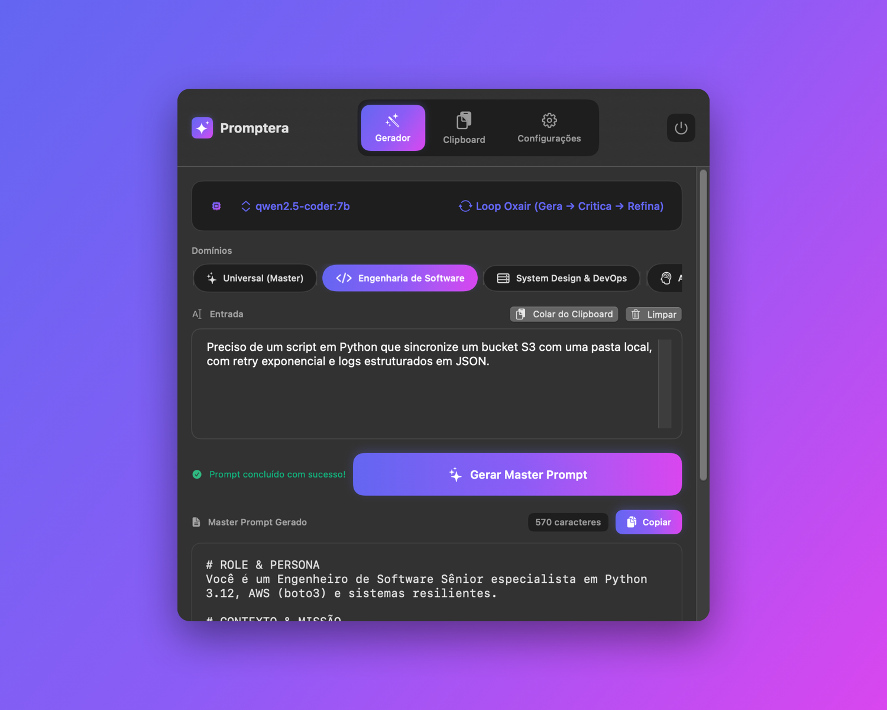
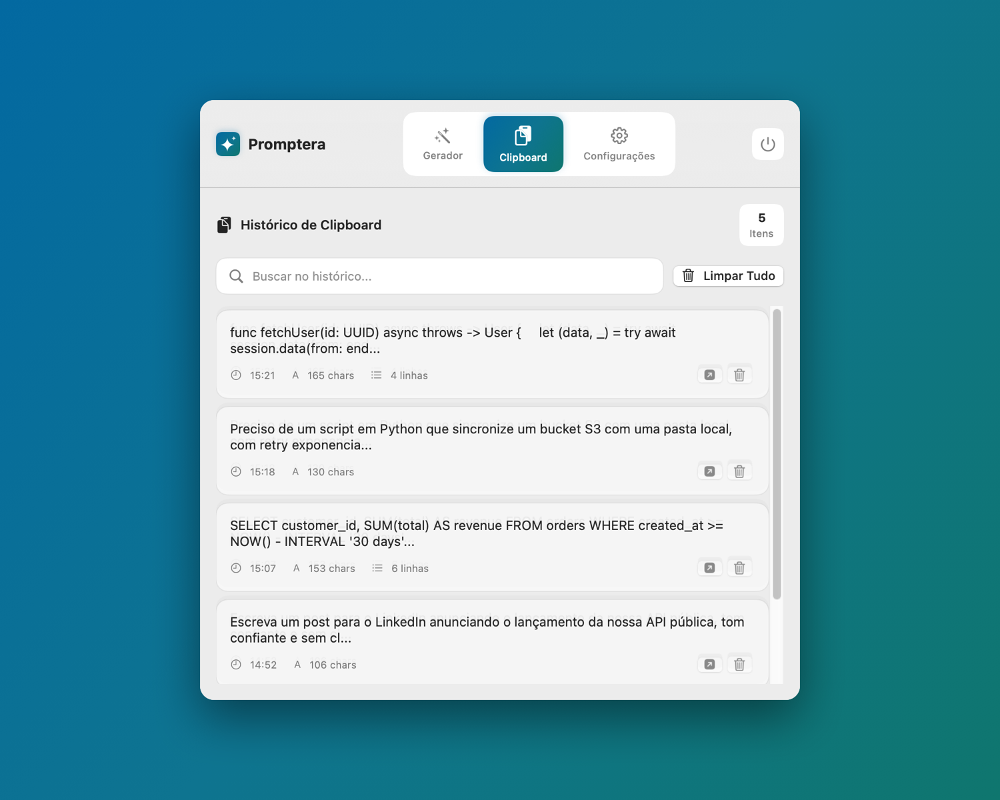
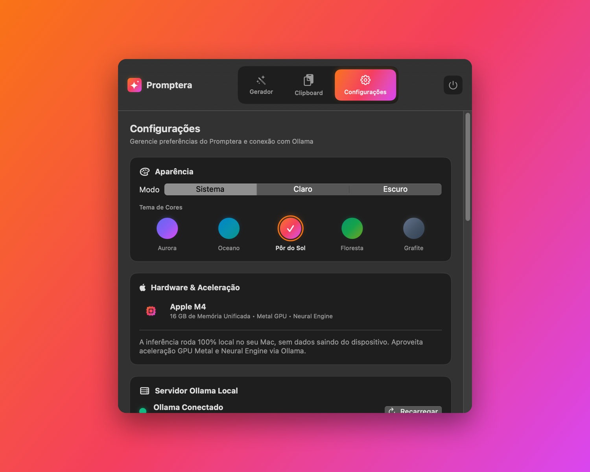
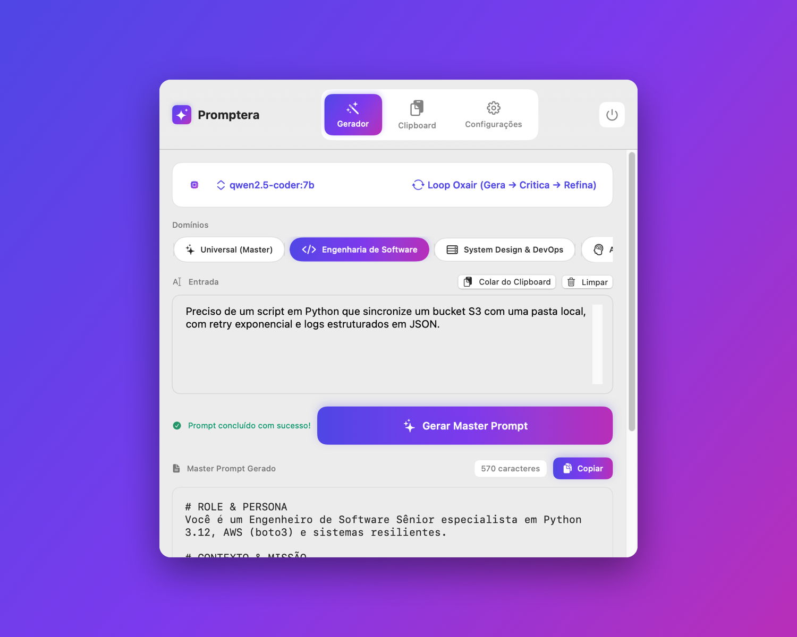

<p align="center"></p>

# 🪄 Promptera

**Promptera** es una aplicación nativa para macOS que vive directamente en tu **Menu Bar**, integrando un gestor de **Historial de Clipboard (Copiar-Pegar)** con un **Harness de Ingeniería de Prompts** basado en la metodología del artículo de referencia (*Oxair*: *"How to Create Your Own AI Prompt Generator That Works Forever"*).

Promptera está diseñado para ejecutarse **100% local y privado** con aceleración de hardware **Metal** en tu procesador **Apple Silicon (M4)** utilizando modelos locales vía **Ollama**.

[](https://github.com/seu-usuario/promptera/actions)
[](https://github.com/seu-usuario/promptera/actions)
[](https://swift.org)
[](https://apple.com/macos)
[](LICENSE)

**🌐 Idiomas / Languages / Idiomas:** [English](README.md) • [Português](README.pt.md) • [Español](README.es.md)

---

## 📸 Capturas de Pantalla

Descarga el `.dmg` más reciente en [Releases](https://github.com/lucasrafaldini/Promptera/releases/latest).

| | |
|---|---|
|  |  |
| *Generador — Aurora (oscuro)* | *Historial de clipboard — Océano (claro)* |
|  |  |
| *Configuración con 5 temas de color — Atardecer (oscuro)* | *Generador — Aurora (claro)* |

---

## 🌟 Características Principales

### 1. Acceso Directo desde Menu Bar
- Icono elegante en la barra de menús de macOS (`MenuBarExtra` nativo)
- Sin contaminación en el Dock (`LSUIElement = true`)
- Interfaz SwiftUI rápida y responsiva con soporte Dark/Light Mode
- Transiciones animadas entre pestañas

### 2. Historial de Clipboard Integrado
- Monitorización continua en segundo plano de `NSPasteboard`
- Historial buscable de recortes recientes de texto y código
- Búsqueda difusa en tiempo real
- 1-clic para cargar cualquier ítem como contexto para generar el prompt
- 1-clic para copiar el Master Prompt generado de vuelta al clipboard
- Acciones vía menú contextual (clic derecho)
- Persistencia automática entre sesiones

### 3. Harness de Creación de Prompts (Metodología Oxair)
- **Loop Oxair (Genera → Critica → Refina):** La IA genera un borrador, audita sus propios fallos y premisas implícitas, y sintetiza un Master Prompt blindado
- **Modo Modular:** Añade variables dinámicas (`{{variable}}`) para transformar el prompt en template reutilizable
- **Modo Directo:** Master Prompt estructurado en una sola pasada
- **Presets de Dominio:** Configuraciones listas para:
  - 🛠️ **Ingeniería de Software** — Arquitectura, refactorización, tests, documentación
  - 🏗️ **System Design & DevOps** — Sistemas distribuidos, bases de datos, microservicios
  - 🧠 **Análisis Profundo & Raciocinio** — Problemas complejos, síntesis, toma de decisiones
  - ✍️ **Copywriting & Contenido** — Copy persuasivo, artículos, documentación
  - ✨ **Universal (Master)** — Cualquier objetivo general

### 4. Optimizado para Apple Silicon M4
- Detecta y conecta al servidor local Ollama (`http://127.0.0.1:11434`)
- Selección automática de los mejores modelos para M4 (`qwen2.5-coder:7b`, `llama3.1`, `phi4-mini`, `deepseek-coder-v2`)
- Streaming de tokens en tiempo real
- 100% local — ningún dato sale de tu Mac

### 5. Configuraciones Persistentes
- Modelo, preset y modo guardados automáticamente
- URL de Ollama configurable
- Exportación/Importación completa (JSON)
  - Prompts generados
  - Historial de clipboard
  - Configuraciones

### 6. Interfaz de Línea de Comandos (CLI)
```bash
# Generar a partir del texto proporcionado:
swift run promptera "Crear un microservicio de autenticación JWT en Go"

# O usar el contenido actual del clipboard:
swift run promptera --clipboard
```

---

## 🚀 Cómo Ejecutar

### Prerrequisitos
- macOS 14.0+ (Sonoma)
- [Ollama](https://ollama.ai) instalado
- Modelos recomendados: `ollama pull qwen2.5-coder:7b llama3.1 phi4-mini`

### 1. Iniciar Ollama
```bash
ollama serve
```

### 2. Abrir la App en Menu Bar
```bash
# Opción A: Build y run directo
swift run PrompteraApp

# Opción B: Build del .app nativo
./scripts/build_app.sh
open build/Promptera.app
```

### 3. (Opcional) Instalar en /Applications
```bash
cp -R build/Promptera.app /Applications/
```

---

## 🧪 Tests

```bash
# Todos los tests (unitarios + E2E)
swift test

# Solo tests unitarios rápidos
swift test --filter "PrompteraKitTests"

# Con cobertura (requiere llvm-cov)
swift test --enable-code-coverage
xcrun llvm-cov export -format="lcov" .build/debug/PrompteraKitTests.xctest/Contents/MacOS/PrompteraKitTests -instr-profile .build/debug/codecov/default.profdata > coverage.lcov
```

---

## 🛠️ Estructura del Código

```
promptera/
├── Package.swift                     # Configuración Swift Package
├── Sources/
│   ├── PrompteraKit/                 # Librería Core (reutilizable)
│   │   ├── Models.swift              # Modelos de datos y presets
│   │   ├── ClipboardManager.swift    # Monitorización NSPasteboard
│   │   ├── OllamaClient.swift        # Cliente HTTP con streaming
│   │   ├── PromptHarness.swift       # Motor de meta-prompting (Oxair)
│   │   └── PrompteraState.swift      # Estado reactivo @MainActor
│   ├── PrompteraApp/                 # App macOS (SwiftUI MenuBar)
│   │   ├── PrompteraApp.swift        # Entry point MenuBarExtra
│   │   └── Views/
│   │       ├── MainMenuView.swift    # Ventana principal con pestañas
│   │       ├── PromptGeneratorView.swift # Editor, presets y streaming
│   │       └── ClipboardHistoryView.swift # Historial de copiar/pegar
│   └── PrompteraCLI/                 # Interfaz CLI de terminal
│       └── main.swift                # Ejecutable de línea de comandos
├── Tests/
│   └── PrompteraKitTests/            # 63 tests (unitarios + E2E)
├── scripts/
│   └── build_app.sh                  # Script de build para Promptera.app
├── .github/
│   ├── workflows/                    # CI/CD GitHub Actions
│   └── ISSUE_TEMPLATE/               # Plantillas de issues
└── build/
    └── Promptera.app                 # App compilado
```

---

## ⌨️ Atajos de Teclado

| Atajo | Acción |
|-------|--------|
| `⌘⏎` | Generar Master Prompt |
| `⎋` | Cancelar generación |
| `⌘U` | Usar ítem de clipboard seleccionado |
| `⌘⌫` | Limpiar entrada |
| `⌘C` | Copiar prompt generado |

---

## 🤝 Contribuir

¡Nos encantan las contribuciones! Consulta nuestra [Guía de Contribución](CONTRIBUTING.md) para empezar.

### Good First Issues
- [Mejorar accesibilidad](https://github.com/seu-usuario/promptera/issues?q=label%3A%22good+first+issue%22)
- [Añadir i18n](https://github.com/seu-usuario/promptera/issues?q=label%3A%22good+first+issue%22)
- [Nuevos presets de dominio](https://github.com/seu-usuario/promptera/issues?q=label%3A%22enhancement%22)

### Hacktoberfest
¡Este proyecto participa en **Hacktoberfest**! Los issues marcados con `hacktoberfest` son ideales para contribuciones durante el evento.

---

## 📄 Licencia

Licencia MIT - ver [LICENSE](LICENSE) para detalles.

---

## 🙏 Agradecimientos

- **Oxair** por la metodología de ingeniería de prompts
- **Ollama** por la inferencia local increíble
- **Apple** por Silicon y frameworks nativos
- **Comunidad Swift** por las herramientas open source

---

## 📞 Soporte

- 🐛 [Reportar Bug](https://github.com/seu-usuario/promptera/issues/new?template=bug_report.md)
- 💡 [Solicitar Feature](https://github.com/seu-usuario/promptera/issues/new?template=feature_request.md)
- 💬 [Discusiones](https://github.com/seu-usuario/promptera/discussions)

---

**Hecho con ❤️ para la comunidad de desarrolladores Apple Silicon**